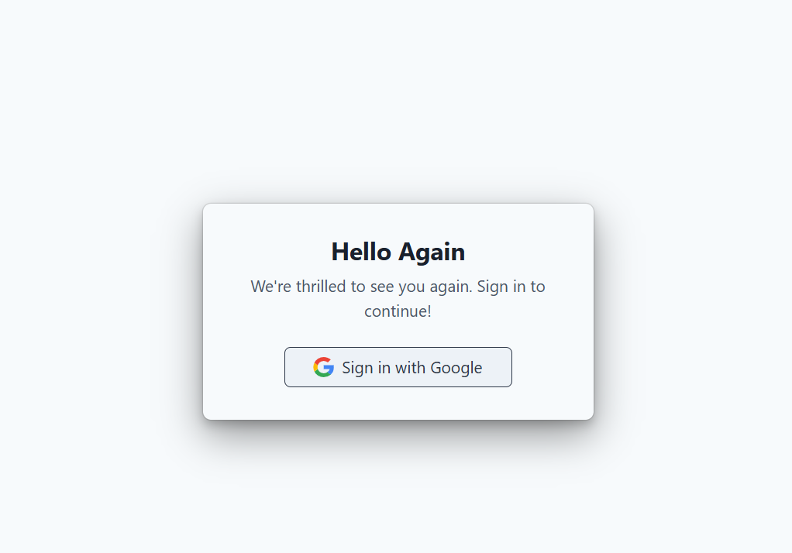
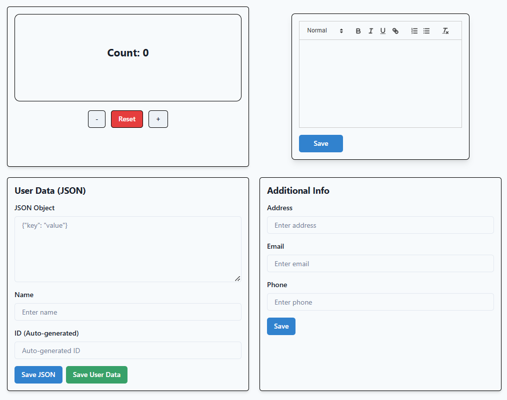

# React Dashboard

This project is a **React** application that showcases:

- A **counter** with an animated background color (using React Spring).
- **Rich text editing** with local storage persistence.
- **Dirty form** checks that warn the user about unsaved changes.
- **User data** forms (JSON data, additional info) stored in local storage.
- **Google-style login** simulation with Redux-based authentication.
- A **private route** for the protected dashboard page.
- **Chakra UI** for styling and layout.

---

## Table of Contents

- [React Dashboard](#react-dashboard)
  - [Table of Contents](#table-of-contents)
    - [Explanation](#explanation)
  - [Key Features](#key-features)
  - [State Management](#state-management)
  - [Dirty Form Hook](#dirty-form-hook)

---

### Explanation

- **`components/`**: Reusable UI components and small forms.  
- **`hooks/`**: Custom hooks (like `useDirtyForm`) for shared logic.  
- **`pages/`**: Route-level components (Dashboard, Login, RichText, etc.).  
- **`store/`**: Redux setup and slices (`authSlice` for authentication, `dataSlice` for app data).  
- **`types/`**: Shared TypeScript interfaces.  
- **`App.tsx`**: Central router, sets up the main routes.  
- **`main.tsx`**: App entry point, wraps in `<Provider>` (Redux) and `<ChakraProvider>`.

---

## Key Features

1. **Counter with Animated Background**  
   - Uses **React Spring** to animate the background color based on the current count.  
   - Buttons for increment, decrement, reset (managed via Redux).

2. **Local Storage Persistence**  
   - The rich text editor, user data, and additional info forms all save data to localStorage.  
   - On reload, previously saved content is restored.

3. **Dirty Form Checks**  
   - A **custom hook** (`useDirtyForm`) warns the user if they try to close or refresh the page with unsaved changes.

4. **Mock Google Sign-In**  
   - A **LoginPage** simulates Google login by dispatching a dummy user to Redux.  
   - The app then redirects to a protected `/dashboard`.

5. **Private Routing**  
   - **PrivateRoute** checks Redux auth state. If not logged in, the user is redirected to `/login`.

6. **Chakra UI**  
   - All styling is done with Chakra UI for a clean, responsive layout.

---

## State Management

We use **Redux Toolkit** for global state:

- **`authSlice.ts`**  
  - Manages `user` object.  
  - Actions: `signIn`, `signOut`.  
  - If `user` is non-null, the user is considered logged in.

- **`dataSlice.ts`**  
  - Holds `counter`, `richTextContent`, and `userFormData`.  
  - Actions like `incrementCounter`, `decrementCounter`, `resetCounter`, etc.

All slices are combined in **`store/index.ts`**, and the store is provided to the app via `<Provider store={store}>` in `main.tsx`.

---

## Dirty Form Hook

The **`useDirtyForm(isDirty: boolean)`** hook:

- Listens for the `beforeunload` event.  
- If `isDirty` is `true`, it prevents closing/reloading without warning the user.  
- Used in **RichTextPage**, **UserDataBox**, and **InfoBox**.
  

